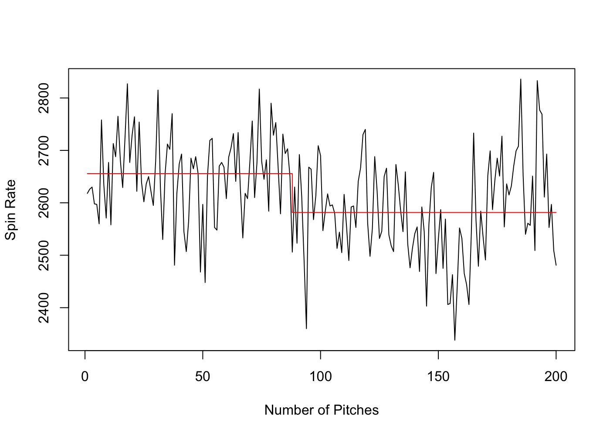

# Change Point Analysis: Detecting Tommy John
#### Author: Luke Snavely

## Motivation

On June 1, 2025, after giving up a hit to Washington Nationals shortstop CJ Abrams, Arizona Diamondbacks pitcher Corbin Burnes knew immediately what happened to him. To the naked eye, it seemed like a simple pitch. However, Burnes stood on the mound, looking frustrated and disappointed, as he knew something was seriously wrong with his arm. It would later be known that Burnes had torn his ulnar collateral ligament (UCL) and would be out for the rest of the season and most of next year. To repair the UCL, players undergo Tommy John surgery, named after the first player to have the procedure. Many believe consistently pitching at a higher velocity, improper care of the arm, and overuse leads to Tommy John. However, there is currently no accurate way of predicting when a pitcher may tear his UCL, due to all these extraneous variables. Utilizing a time series change point analysis approach, this study aims detect changes in a pitcher’s fastball velocity and spin rate as a potential predictor of Tommy John surgery.

## Data Collection

The data consists of 51 pitchers, 30 players without ever undergoing Tommy John surgery and 21 players with Tommy John surgery. These 21 pitchers span from the 2021 to 2025 MLB seasons. To qualify, pitchers must throw at least 200 fastballs (four-seam, sinker, two-seam, cutter, or splitter), which may encompass approximately 3 games for a starting pitcher. This is to ensure the modeling has enough data points to detect a possible change and identify when the UCL tear occurs. We choose to analyze fastballs, as they are the most thrown pitch in the MLB. However, analyzing off speed pitches, if consistently in a greater quantity, may more accurately represent the strain on a pitcher’s elbow. Pitchers had to throw at least 200 pitches in the season they underwent Tommy John. Yet only 21 pitchers fit this criterion, as many players go on the Injury Reserve (IR) within the first two months of the season for Tommy John. 

As for the 30 players without Tommy John, we randomly select them from all 2025 qualified pitchers on MLB Savant, the MLB’s database and analytics site. We then look at their first 200 primary fastball pitches of the season. An example of collected pitch-by-pitch data on Savant is shown in the figure below.

  

 
Here, we specifically want to focus on a pitcher’s fastball’s spin rate and velocity over time. With 200 pitches from each of the 51 pitchers, the analysis aims to find a change in spin rate or velocity, which may be indicative of a UCL tear.

## Methodology
Change point analysis is a type of time series modeling that aims to detect changes in variables over time. The modeling does this by detecting changes in a variable’s mean, variance, or both mean and variance (Killick, 2021). However, the tuning of the model can greatly affect the output. In R programming language, we tune and set the modeling with the following formula:
			
      cpt.meanvar(changepoint_data$release_spin_rate,
                  method = "PELT",
                  minseglen = 20)
                  
In this case, we are looking at a pitcher’s fastball spin rate for 200 pitches. We are looking for pitches that see a shift in both the mean and variance of the fastball. Setting method = “PELT”, which stands for Pruned Exact Linear Time, ensures an exact and computationally efficient algorithm. PELT utilizes a pruning step to eliminate any potential change points that are not optimal, eventually finding the optimal solution (How Change Point Detection Works—ArcGIS pro | Documentation, n.d.). The method is well suited for large sample sizes, another reason why 200 fastballs were necessary. Finally, the parameter minseglen = 20 ensures that there is not an abundance of unnecessary change points (Killick, 2021). Each segment before and after a change point must consist of at least 20 pitches. We can see Burnes’ change point analysis for spin rate in the following graph.

<h3 align="center">Burnes experiences one change point in fastball spin rate before TJ </h3>

  

Burnes experiences a change point 110 fastballs before going on season-ending IR. His mean spin rate decreases from around 2650 rotations per minute (RPM) to 2600 RPM. Following this logic, we would expect to see a change point signifying a decrease in spin rate and velocity for pitchers who are going to suffer a UCL tear.

<h3 align="center">Burnes experiences three change points in fastball MPH before TJ </h3>

  

In this case, Burnes experiences multiple change points in fastball velocity before his injury. Interestingly, his mean velocity dips but then increases within his final 50 pitches. This is not the trend one would expect for a pitcher about to be faced with Tommy John. We then run these two models for the other 50 pitchers to determine if results are similar.

## Results
To determine a relationship between change points and pitchers getting Tommy John, we utilize t-tests. These statistical tests can show if a categorical variable (Tommy John indicator) and a numerical variable are statistically significant. A low p-value less than the threshold of 0.05 suggests that there is statistical signifance, that is if this type of change point analysis can be used as a predictor for potential Tommy John injury. The numeric variables we are using to test are the difference in mean spin rate and velocity from the last change point (if there is no change point, the difference is 0) and the number of change points for spin rate and velocity. The results are described in the table below.

  

The p-values of the test suggest that the results of change point analysis for fastball spin rate and velocity are not significant with the Tommy John Indicator. Essentially, changes in fastball spin rate and velocity may be due to random variance or other confounding factors.

## Conclusions & Limitations
This analysis found no statistical significance between differences in change points for Tommy John and non Tommy John pitchers. However, there are several reasons for this. Tommy John is not an immediate injury, as it’s one that builds up over time. A single pitch will not cause an UCL tear. Tommy John is a combination of in-game pitches and outside work, data which we do not have access. Predicting the injury solely based off of changes in fastball spin rate and velocity is simply not be enough with so many confounding variables.

In addition to this, there are several other limitations to the study. The analysis featured a small sample size of Tommy John players, as there were only 21 qualified candidates. It is difficult to find Tommy John pitchers who have enough pitches for modeling but have also torn the ligament during the season. The analysis also only focused on fastballs, as the type of pitch was most commonly thrown. However, analyzing offspeed pitches may produce different results. Finally, the change point formula can be tuned differently. There are other methods in determining change points, and the minimum segment length can be changed. Performing a sensitivity analysis with this minmum segment length parameter may produce better results. Future work should look into changing these parameters and examining other pitch types. However, this analysis finds no significant relationship between changes in mean and variance of fastball spin rate and velocity and the Tommy John indicator.
 
## References

How Change Point Detection works—ArcGIS Pro | Documentation. (n.d.). Pro.arcgis.com. https://pro.arcgis.com/en/pro-app/latest/tool-reference/space-time-pattern-mining/how-change-point-detection-works.htm

Killick, Rebecca. (2021, November).  NHS-R Workshop: Introduction to changepoint analysis with R- November 2021. YouTube. https://www.youtube.com/watch?v=UfGrLJ7S3sc.

